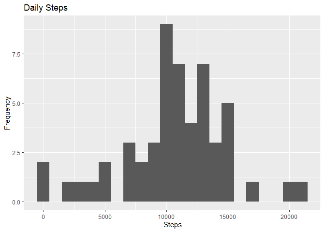

## Peer-graded Assignment: Course Project 1

This assignment makes use of data from a personal activity monitoring device. This device collects data at 5 minute intervals through out the day. The data consists of two months of data from an anonymous individual collected during the months of October and November, 2012 and include the number of steps taken in 5 minute intervals each day.

## Loading Packages 


```
## Warning: package 'dplyr' was built under R version 3.5.3
```

```
## 
## Attaching package: 'dplyr'
```

```
## The following objects are masked from 'package:stats':
## 
##     filter, lag
```

```
## The following objects are masked from 'package:base':
## 
##     intersect, setdiff, setequal, union
```

```
## Warning: package 'lubridate' was built under R version 3.5.3
```

```
## 
## Attaching package: 'lubridate'
```

```
## The following objects are masked from 'package:dplyr':
## 
##     intersect, setdiff, union
```

```
## The following objects are masked from 'package:base':
## 
##     date, intersect, setdiff, union
```

```
## Warning: package 'data.table' was built under R version 3.5.3
```

```
## 
## Attaching package: 'data.table'
```

```
## The following objects are masked from 'package:lubridate':
## 
##     hour, isoweek, mday, minute, month, quarter, second, wday, week,
##     yday, year
```

```
## The following objects are masked from 'package:dplyr':
## 
##     between, first, last
```

## lOading Data

```r
fileUrl <- "https://d396qusza40orc.cloudfront.net/repdata%2Fdata%2Factivity.zip"
download.file(fileUrl, destfile = paste0(getwd(), '/repdata%2Fdata%2Factivity.zip'), method = "curl")
unzip("repdata%2Fdata%2Factivity.zip",exdir = "data")

activitydata <- data.table::fread(input = "data/activity.csv")
```

## Getting some insights about data

```r
head(activitydata)
```

```
##    steps       date interval
## 1:    NA 2012-10-01        0
## 2:    NA 2012-10-01        5
## 3:    NA 2012-10-01       10
## 4:    NA 2012-10-01       15
## 5:    NA 2012-10-01       20
## 6:    NA 2012-10-01       25
```

```r
tail(activitydata)
```

```
##    steps       date interval
## 1:    NA 2012-11-30     2330
## 2:    NA 2012-11-30     2335
## 3:    NA 2012-11-30     2340
## 4:    NA 2012-11-30     2345
## 5:    NA 2012-11-30     2350
## 6:    NA 2012-11-30     2355
```

```r
glimpse(activitydata)
```

```
## Rows: 17,568
## Columns: 3
## $ steps    <int> NA, NA, NA, NA, NA, NA, NA, NA, NA, NA, NA, NA, NA, NA, NA...
## $ date     <chr> "2012-10-01", "2012-10-01", "2012-10-01", "2012-10-01", "2...
## $ interval <int> 0, 5, 10, 15, 20, 25, 30, 35, 40, 45, 50, 55, 100, 105, 11...
```

```r
str(activitydata)
```

```
## Classes 'data.table' and 'data.frame':	17568 obs. of  3 variables:
##  $ steps   : int  NA NA NA NA NA NA NA NA NA NA ...
##  $ date    : chr  "2012-10-01" "2012-10-01" "2012-10-01" "2012-10-01" ...
##  $ interval: int  0 5 10 15 20 25 30 35 40 45 ...
##  - attr(*, ".internal.selfref")=<externalptr>
```
## converting date column to date data type

```r
activitydata$Date <- as.Date(paste0(as.character(activitydata$date), format = "ymd"))
```

## Histogram of the total number of steps taken each day

```r
Steps <- activitydata %>%
  group_by(Date) %>%
  summarise( Total = sum(steps), na.rm = TRUE)

# Drawing the histogram 
ggplot(Steps)+
  geom_histogram(aes(x = Total), binwidth = 1000) +
  labs(title = "Daily Steps", x = "Steps", y = "Frequency")
```

```
## Warning: Removed 8 rows containing non-finite values (stat_bin).
```

<!-- -->
## Mean and median number of steps taken each day


```r
rawsteps_mean <- mean(Steps$Total, na.rm=TRUE)
rawsteps_median <- median(Steps$Total, na.rm=TRUE)
print(paste("The mean steps per day is: ", rawsteps_mean))
```

```
## [1] "The mean steps per day is:  10766.1886792453"
```

```r
print(paste("The median steps per day is: ", rawsteps_median))
```

```
## [1] "The median steps per day is:  10765"
```
## Time series plot of the average number of steps taken


```r
IntervalDT <- activitydata[, c(lapply(.SD, mean, na.rm = TRUE)), .SDcols = c("steps"), by = .(interval)] 

ggplot(IntervalDT, aes(x = interval , y = steps)) + geom_line(color="blue", size=1) + labs(title = "Avg. Daily Steps", x = "Interval", y = "Avg. Steps per day")
```

<!-- -->
## Which 5-minute interval, on average across all the days in the dataset, contains the maximum number of steps?

```r
IntervalDT[steps == max(steps), .(max_interval = interval)]
```

```
##    max_interval
## 1:          835
```
## Calculate and report the total number of missing values in the dataset (i.e. the total number of rows with ????????s)

```r
activitydata[is.na(steps), .N ]
```

```
## [1] 2304
```

Code to describe and show a strategy for imputing missing data.

```r
# Filling in missing values with median of dataset. 
activitydata[is.na(steps), "steps"] <- activitydata[, c(lapply(.SD, median, na.rm = TRUE)), .SDcols = c("steps")]
```
Creating a new dataset that is equal to the original dataset but with the missing data filled in.

```r
data.table::fwrite(x = activitydata, file = "data/tidyData.csv", quote = FALSE)
```
Making a histogram of the total number of steps taken each day and calculate and report the mean and median total number of steps taken per day. Do these values differ from the estimates from the first part of the assignment? What is the impact of imputing missing data on the estimates of the total daily number of steps?

```r
# total number of steps taken per day
Total_Steps <- activitydata[, c(lapply(.SD, sum)), .SDcols = c("steps"), by = .(date)] 

# mean and median total number of steps taken per day
Total_Steps[, .(Mean_Steps = mean(steps), Median_Steps = median(steps))]
```

```
##    Mean_Steps Median_Steps
## 1:    9354.23        10395
```

```r
ggplot(Total_Steps, aes(x = steps)) + geom_histogram(fill = "blue", binwidth = 1000) + labs(title = "Daily Steps", x = "Steps", y = "Frequency")
```

<!-- -->
## Are there differences in activity patterns between weekdays and weekends?
Create a new factor variable in the dataset with two levels - "weekday" and "weekend" indicating whether a given date is a weekday or weekend day.

```r
# Just recreating activitydata from scratch then making the new factor variable. (No need to, just want to be clear on what the entire process is.) 
activitydata <- data.table::fread(input = "data/activity.csv")
activitydata[, date := as.POSIXct(date, format = "%Y-%m-%d")]
activitydata[, `Day of Week`:= weekdays(x = date)]
activitydata[grepl(pattern = "Monday|Tuesday|Wednesday|Thursday|Friday", x = `Day of Week`), "weekday or weekend"] <- "weekday"
activitydata[grepl(pattern = "Saturday|Sunday", x = `Day of Week`), "weekday or weekend"] <- "weekend"
activitydata[, `weekday or weekend` := as.factor(`weekday or weekend`)]
head(activitydata, 10)
```

```
##     steps       date interval Day of Week weekday or weekend
##  1:    NA 2012-10-01        0      Monday            weekday
##  2:    NA 2012-10-01        5      Monday            weekday
##  3:    NA 2012-10-01       10      Monday            weekday
##  4:    NA 2012-10-01       15      Monday            weekday
##  5:    NA 2012-10-01       20      Monday            weekday
##  6:    NA 2012-10-01       25      Monday            weekday
##  7:    NA 2012-10-01       30      Monday            weekday
##  8:    NA 2012-10-01       35      Monday            weekday
##  9:    NA 2012-10-01       40      Monday            weekday
## 10:    NA 2012-10-01       45      Monday            weekday
```
Make a panel plot containing a time series plot (i.e. ???????????????? = "????") of the 5-minute interval (x-axis) and the average number of steps taken, averaged across all weekday days or weekend days (y-axis). See the README file in the GitHub repository to see an example of what this plot should look like using simulated data.


```r
activitydata[is.na(steps), "steps"] <- activitydata[, c(lapply(.SD, median, na.rm = TRUE)), .SDcols = c("steps")]
IntervalDT <- activitydata[, c(lapply(.SD, mean, na.rm = TRUE)), .SDcols = c("steps"), by = .(interval, `weekday or weekend`)] 

ggplot(IntervalDT , aes(x = interval , y = steps, color=`weekday or weekend`)) + geom_line() + labs(title = "Avg. Daily Steps by Weektype", x = "Interval", y = "No. of Steps") + facet_wrap(~`weekday or weekend` , ncol = 1, nrow=2)
```

<!-- -->

